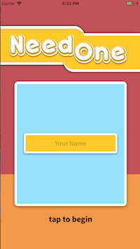
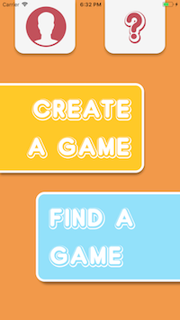
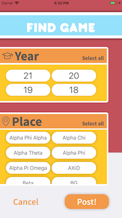

# Need One
We are three Dartmouth students from the class of 2021 working as Women in Science Program (WISP) interns in conjunction with the DALI Lab for the 2017-2018 school year.

Need One is designed to improve social integration at Dartmouth through the game of pong. Need One will serve as a platform to connect a user with a partner to play with, either by searching for or posting a game. We hope that this will become an easy way for new members of the Dartmouth community, such as freshmen or transfer students, to branch out and interact with new people. Additionally, the app could serve as a mechanism for upperclassmen to reach out to underclassmen and make Dartmouth a more inclusive place.

## Architecture

* [Expo](https://expo.io/) is a tool for React Native applications that, by providing a prototype formate, aided our development process.
* [React Native](https://facebook.github.io/react-native/) is the programming language we used to design and develop the structure of our iOS and Android application.
* [Firebase](https://firebase.google.com) is a Google platform/infrastructure that provides us with a database to implement the backend of our app.

## Setup

1. Clone the repo: `git clone https://github.com/jennyengelman/PongMates.git`
2. Enter the app's folder
3. Run `npm install` to install all node packages
4. Run `react-native link` to link all the assets in the project

## Deployment
1. In terminal tab, run `exp start` to run the server
2. In another terminal tab, run `exp ios` to run the iOS simulator

## Authors
* Urie Choi '21
* Jenny Engelman '21
* Aly Milich '21

## Acknowledgments

We'd like to thank our faculty advisor Lorie Loeb and mentor Ijemma Onwuzulike (Dartmouth class of ‘19) for their guidance and the hard work they've contributed to helping us succeed in achieving our goals within, as well as outside, this project.
